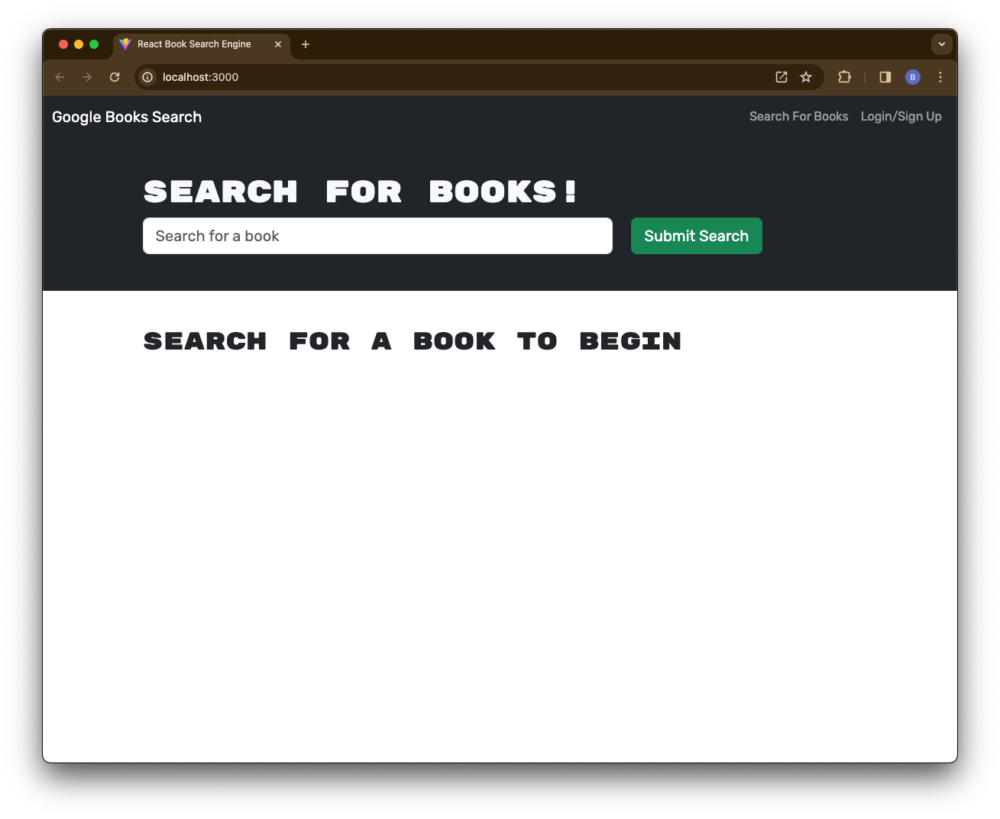
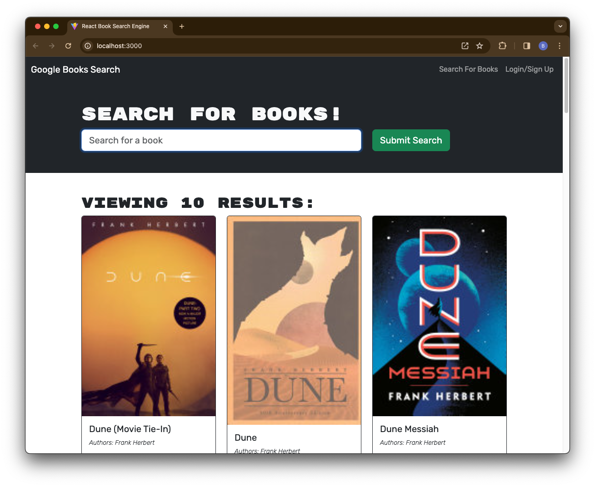

# MERN Book Search Engine

## Description

This is a search engine where users can look up books and add them to a personal list. Using an API any search results are returned with some associated information, such as it's title, author(s), description, an image and link to Google Books. The log-in/sign-up in the header allow the user to access their own account with which to edit their book list. Existing code has been refactored to ensure it is using a GraphQL API and an Apollo Server.

## Installation

If using from a local device, clone from GitLab and ensure you are use the following commands with the root folder in your terminal.
- `npm install` will ensure all dependencies and devdependencies are ready to be used
- `npm run develop` will simultaneously enable functionality in the server and client folders, and will be live on localhost:3000

## Screenshots

## Project Status

At the moment the code is able to deploy on a local browser, but the "signup" functionality does not work as intended. As such, testing for further functionality is hindered. The deployment to Heroku has also thrown some problems as it does not seem to deploy correctly.